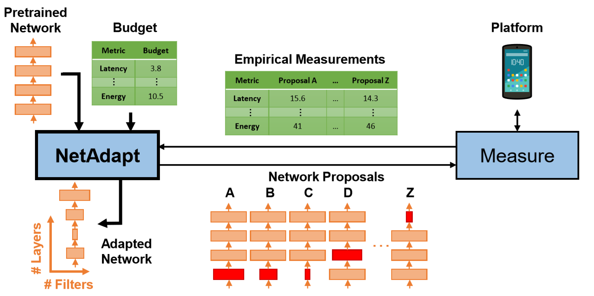

NetAdapt: Platform-Aware Neural Network Adaptation for Mobile Applications
============================
This repo contains the official Pytorch reimplementation of the paper "NetAdapt: Platform-Aware Neural Network Adaptation for Mobile Applications"
[[paper](http://openaccess.thecvf.com/content_ECCV_2018/papers/Tien-Ju_Yang_NetAdapt_Platform-Aware_Neural_ECCV_2018_paper.pdf)]
[[project](https://netadapt.mit.edu)]. The results in the paper were generated by the Tensorflow implementation from Google AI.
<p align="center">
	
</p>

## Summary ##
0. [Requirements](#requirements)
0. [Usage](#usage)
0. [Example](#example)
0. [Customization](#customization)
0. [Citation](#citation)

<!---
## Docs ##
`constants.py` : defines constants and some layers that can be simplified by this algorithm.

`worker.py` : called by `master.py` to simplify a certain block of the network based on resource constraints and then run short-term finetune of simplified models. Several workers may execute at the same time.

`network_utils_abstract.py` : defines abstract base class for networks. 

`network_utils_depth_mobilenetv1` : an example defining mobilenet, its correspoding loss function, data loaders.

`functions.py` : defines some utility functions like computing MACs, getting feature map sizes that would be used `network_utils`.
--->

## Requirements ##
The code base is tested with the following setting:

1. Python 3.7.0
2. CUDA 10.0
3. Pytorch 1.2.0
4. torchvision 0.4.0
5. numpy 1.17.0
6. scipy 1.3.1

First clone the repo in the directory you want to work:

        git clone https://github.com/denru01/netadapt.git  
        cd netadapt

In the following context, we assume you are at the repo root.

If the versions of Python and CUDA are the same as yours, you can download the python packages using:
    
        pip install -r requirements.txt
    
To verify the downloaded code base is correct, please run either

        sh scripts/unittest.sh
        
or

        sh scripts/unittest_helloworld.sh
        sh scripts/unittest_alexnet.sh
        sh scripts/unittest_mobilenet.sh
        
If it is correct, you should not see any FAIL.

## Usage ##
In order to apply NetAdapt, run:
            
        python master.py [-h] [-gp GPUS [GPUS ...]] [-re] [-im INIT_MODEL_PATH]
                 [-mi MAX_ITERS] [-lr FINETUNE_LR] [-bu BUDGET]
                 [-bur BUDGET_RATIO] [-rt RESOURCE_TYPE]
                 [-ir INIT_RESOURCE_REDUCTION]
                 [-irr INIT_RESOURCE_REDUCTION_RATIO]
                 [-rd RESOURCE_REDUCTION_DECAY]
                 [-st SHORT_TERM_FINE_TUNE_ITERATION] [-lt LOOKUP_TABLE_PATH]
                 [-dp DATASET_PATH] [-a ARCH] [-si SAVE_INTERVAL]
                 working_folder input_data_shape input_data_shape
                 input_data_shape

- `working_folder`: Root folder where models, related files and history information are saved. You can see how models are pruned progressively in `working_folder/master/history.txt`.

- `input_data_shape`: Input data shape (C, H, W) (default: 3 224 224). If you want to apply NetAdapt to different tasks, you might need to change data shape.

- `-h, --help`: Show this help message and exit.
            
- `-gp GPUS [GPUS ...],  --gpus GPUS [GPUS ...]`: Indices of available gpus (default: 0).
            
- `-re, --resume`: Resume from previous iteration. In order to resume, specify `--resume` and specify `working_folder` as the one you want to resume. 
The resumed arguments will overwrite the arguments provided here.
For example, if you want to simplify a model by pruning and finetuning for 30 iterations (under `working_folder`), however, your program terminated after 20 iterations.
Then you can use `--resume` to restore and continue for the last 10 iterations.
            
- `-im INIT_MODEL_PATH, --init_model_path INIT_MODEL_PATH`: Path to pretrained model.
            
- `-mi MAX_ITERS, --max_iters MAX_ITERS`: Maximum iteration of removing filters and short-term fine-tune (default: 10).
            
- `-lr FINETUNE_LR, --finetune_lr FINETUNE_LR`: Short-term fine-tune learning rate (default: 0.001).
            
- `-bu BUDGET, --budget BUDGET`: Resource constraint. If resource < `budget`, the process is terminated.
            
- `-bur BUDGET_RATIO, --budget_ratio BUDGET_RATIO`: If `--budget` is not specified, `buget` = `budget_ratio`\*(pretrained model resource) (default: 0.25).
            
- `-rt RESOURCE_TYPE, --resource_type RESOURCE_TYPE`: Resource constraint type (default: FLOPS). We currently support `FLOPS`, `WEIGHTS`, and `LATENCY` (device `cuda:0`). If you want to add other resource
types, please modify `def compute_resource(...)` in `network_util` python files (e.g. `network_utils/network_utils_alexnet`).
            
- `-ir INIT_RESOURCE_REDUCTION, --init_resource_reduction INIT_RESOURCE_REDUCTION`: For each iteration, target resource = current resource - `init_resource_reduction`\*(`resource_reduction_decay`\*\*(iteration-1)).

- `-irr INIT_RESOURCE_REDUCTION_RATIO, --init_resource_reduction_ratio INIT_RESOURCE_REDUCTION_RATIO`: If `--init_resource_reduction` is not specified,
`init_resource_reduction` = `init_resource_reduction_ratio`\*(pretrained model resource) (default: 0.025).

- `-rd RESOURCE_REDUCTION_DECAY, --resource_reduction_decay RESOURCE_REDUCTION_DECAY`: For each iteration, target resource = current resource - `init_resource_reduction`\*(`resource_reduction_decay`\*\*(iteration-1)) (default: 0.96).
            
- `-st SHORT_TERM_FINE_TUNE_ITERATION, --short_term_fine_tune_iteration SHORT_TERM_FINE_TUNE_ITERATION`: Short-term fine-tune iteration (default: 10).

- `-lt LOOKUP_TABLE_PATH, --lookup_table_path LOOKUP_TABLE_PATH`: Path to lookup table.

- `-dp DATASET_PATH, --dataset_path DATASET_PATH`: Path to dataset.

- `-a ARCH, --arch ARCH  network_utils`: Defines how networks are pruned, fine-tuned, and evaluated. If you want to use
your own method, please see [**Customization**](#customization) and specify here. (default: alexnet)
            
- `-si SAVE_INTERVAL, --save_interval SAVE_INTERVAL`: Interval of iterations that all pruned models at the same iteration will be saved. 
Use `-1` to save only the best model at each iteration. 
Use `1` to save all models at each iteration. (default: -1).


## Example ##
<!---

We provide an example of applying **NetAdapt** to **AlexNet** on **CIFAR-10**. 
If you want to apply the algorithm to different networks or even different tasks,
please see the following [**Customization**](#customization) section. 

The example consists of the following four steps: 1. training AlexNet on CIFAR-10; 2. measuring latency; 3. applying NetAdapt; 4. evaluation using adapted models.

1. **Training AlexNet on CIFAR-10.**

    Train from scratch:
    ```bash
    python train.py data/ --dir models/alexnet/no-pretrain/checkpoint.pth.tar --arch alexnet
    ```
    Use Imagenet-pretrained model:
    ```bash
    python train.py data/ --dir models/alexnet/pretrain/checkpoint.pth.tar --pretrained --lr 0.01 --arch alexnet
    ```
    Evaluation:
    ```bash
    python eval.py data/ --dir models/alexnet/no-pretrain/checkpoint.pth.tar --arch alexnet
    ```
    
    ```bash
    python train.py data/ --dir models/mobilenet/model.pth.tar --arch mobilenet
    ```
2. **Measuring Latency**

    Here we build the latency lookup table for `cuda:0` device:
    ```bash
    python build_lookup_table.py --dir latency_lut/lut_alexnet.pkl --arch alexnet
    ```
    It measures latency of different layers contained in the network (i.e. **AlexNet** here).
    For conv layers, the sampled numbers of feature channels are multiples of `MIN_CONV_FEATURE_SIZE`.
    For fc layers, the sampled numbers of features are multiples of `MIN_FC_FEATURE_SIZE`. 
        
3. **Applying NetAdapt**

    Modify which GPUs will be utilized (`-gp`) in `netadapt_alexnet.sh` and run the script to apply NetAdapt to a pretrained model:
    ```bash
    sh netadapt_alexnet.sh
    ```
    
    After obtaining the adapted model, we need to finetune the model:
    ```bash
    python train.py data/ --arch alexnet --resume models/alexnet/no-pretrain/prune-by-mac/iter_100_best_model.pth.tar --dir models/alexnet/no-pretrain/checkpoint-adapt.pth.tar
    ```
    
    <p align="center">
	
    </p>

4. **Evaluation Using Adapted Models**

    After applying NetAdapt to a pretrained model, we can evaluate this adapted model using:
    ```bash
    python eval.py data/ --dir models/alexnet/no-pretrain/checkpoint-adapt.pth.tar --arch alexnet
    ```
    The adapted model can be restored **without modifying the orignal python file**.

--->

We provide a simple example of applying **NetAdapt** to a very small [network](nets/helloworld.py):
    
        sh scripts/netadapt_helloworld.sh

Detailed examples of applying **NetAdapt** to **AlexNet**/**MobileNet** on **CIFAR-10** are shown [**here (AlexNet)**](docs/alexnet/README.md) and [**here (MobileNet)**](docs/mobilenet/README.md).

<p align="center">

</p>

If you want to apply the algorithm to different networks or even different tasks,
please see the following [**Customization**](#customization) section.


## Customization ##

To apply NetAdapt to differenct networks or different tasks, please follow the instructions:

1. Create your own `network_utils` python file (said `network_utils_yourNetworkOrTask.py`) and place it under `network_utils`.

2. Implement functions described in [`network_utils_abstract.py`](network_utils/network_utils_abstract.py).

3. As we provide an example of applying NetAdapt to AlexNet, you can also build your `network_utils` based on [`network_utils_alexnet.py`](network_utils/network_utils_alexnet.py):
    
    ```bash
        cd network_utils
        cp network_utils_alexnet.py ./network_utils_yourNetworkOrTask.py
    ```
    
4. Add `from .network_utils_yourNetworkOrTask import *` to `__init__.py`, which is under [the same directory](network_utils/__init__.py).

5. Modify `class networkUtils_alexnet(...)` in [line 44](network_utils/network_utils_alexnet.py#L44) in `network_utils_yourNetworkOrTask.py` to `class networkUtils_yourNetworkOrTask(...)`.
    
6. Modify `def alexnet(...)` in [line 325-326](network_utils/network_utils_alexnet.py#L325-L326) to:
    ```bash
        def yourNetworkOrTask(model, input_data_shape, dataset_path, finetune_lr=1e-3):
            return networkUtils_yourNetworkOrTask(model, input_data_shape, dataset_path, finetune_lr)
    ```

7. Specify training/validation data loader, loss functions, optimizers, network architecture, training method, and evaluation method in `network_utils_yourNetworkOrTask.py` if there is any difference from the AlexNet example:
    
    - Modify data loader and loss functionsin function `def __init__(...):` in [line 52](network_utils/network_utils_alexnet.py#L52-L125).
    
    - Specify additive skip connections if there is any and modify `def simplify_network_def_based_on_constraint(...)` in `network_utils_yourNetworkOrTask.py`.
    You can see how our implementation uses additive skip connections [here](functions.py#L543-L549).
    
    - Modify training method (short-term finetune) in function `def fine_tune(...):` in [line 245](network_utils/network_utils_alexnet.py#L245-L288).
    
    - Modify evaluation method in function `def evaluate(...):` in [line 291](network_utils/network_utils_alexnet.py#L291-L322).

    You can see how these methods are utilized by the framework [here](worker.py#L39-L62).

8. Our current code base supports pruning `Conv2d`, `ConvTranspose2d`, and `Linear` with additive skip connection.
If your network architecture is not supported, please modify [this](network_utils/network_utils_alexnet.py#L142-L199).
If you want to use other metrics (resource type) to prune networks, please modify [this](network_utils/network_utils_alexnet.py#L234-L238).

9. We can apply NetAdapt to different networks or tasks by using `--arch yourNetworkOrTask` in `scripts/netadapt_alexnet-0.5mac.sh`.
As for the values of other arguments, please see [**Usage**](#usage). 
Generally, if you want to apply NetAdapt to a different task, you might change `input_data_shape`.
If your network architecture is very different from that of MobileNet, you would have to modify the values of `--init_resource_reduction_ratio` and `--resource_reduction_decay` to get a different resource reduction schedule.


## Citation
If you use our code or method in your work, please consider citing the following:

```
@InProceedings{eccv_2018_yang_netadapt,
	author = {Yang, Tien-Ju and Howard, Andrew and Chen, Bo and Zhang, Xiao and Go, Alec and Sandler, Mark and Sze, Vivienne and Adam, Hartwig},
	title = {NetAdapt: Platform-Aware Neural Network Adaptation for Mobile Applications},
	booktitle = {The European Conference on Computer Vision (ECCV)},
	month = {September},
	year = {2018}
}
```

Please direct any questions to the authors: Tien-Ju Yang (tjy@mit.edu) and Yi-Lun Liao (ylliao@mit.edu).
