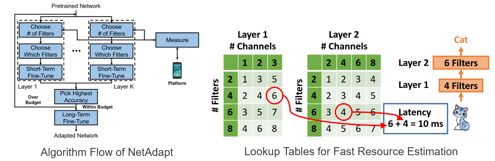

1. **Training AlexNet on CIFAR-10.**

    Training:
    ```bash
    python train.py data/ --dir models/alexnet/model.pth.tar --arch alexnet
    ```
    
    Evaluation:
    ```bash
    python eval.py data/ --dir models/alexnet/model.pth.tar --arch alexnet
    ```
    
    One trained model can be found [here](https://drive.google.com/file/d/1GwugqlSl5ogRvJ2F2-4uz1fXBzt36ahB/view?usp=sharing).

2. **Measuring Latency**

    Here we build the latency lookup table for `cuda:0` device:
    ```bash
    python build_lookup_table.py --dir latency_lut/lut_alexnet.pkl --arch alexnet
    ```
    It measures latency of different layers contained in the network (i.e. **AlexNet** here).
    For conv layers, the sampled numbers of feature channels are multiples of `MIN_CONV_FEATURE_SIZE`.
    For fc layers, the sampled numbers of features are multiples of `MIN_FC_FEATURE_SIZE`. 
        
3. **Applying NetAdapt**

    Modify which GPUs will be utilized (`-gp`) in `netadapt_alexnet-0.5mac.sh` and run the script to apply NetAdapt to a pretrained model:
    ```bash
    sh scripts/netadapt_alexnet-0.5mac.sh
    ```
    
    You can see how the model is simplified at each iteration in `models/alexnet/prune-by-mac/master/history.txt` and
    select the one that satisfies the constraints to run long-term fine-tune.
    
    After obtaining the adapted model, we need to finetune the model (here we select the one after 18 iterations):
    ```bash
    python train.py data/ --arch alexnet --resume models/alexnet/prune-by-mac/master/iter_18_best_model.pth.tar --dir models/alexnet/prune-by-mac/master/finetune_model.pth.tar --lr 0.001
    ```
    
    <p align="center">
	
    </p>
    
    
    If you want to get a model with 50% latency, please run:
    ```bash
    sh scripts/netadapt_alexnet-0.5latency.sh
    ```
    
4. **Evaluation Using Adapted Models**

    After applying NetAdapt to a pretrained model, we can evaluate this adapted model using:
    ```bash
    python eval.py data/ --dir models/alexnet/prune-by-mac/master/finetune_model.pth.tar --arch alexnet
    ```
    
    The adapted model can be restored **without modifying the orignal python file**.
    
    We provide one adapted model [here](https://drive.google.com/file/d/1VH9c2orF2W0P21gD8NrdTdvwP_uJJgYA/view?usp=sharing).